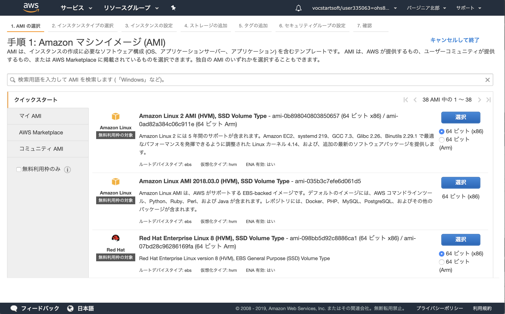
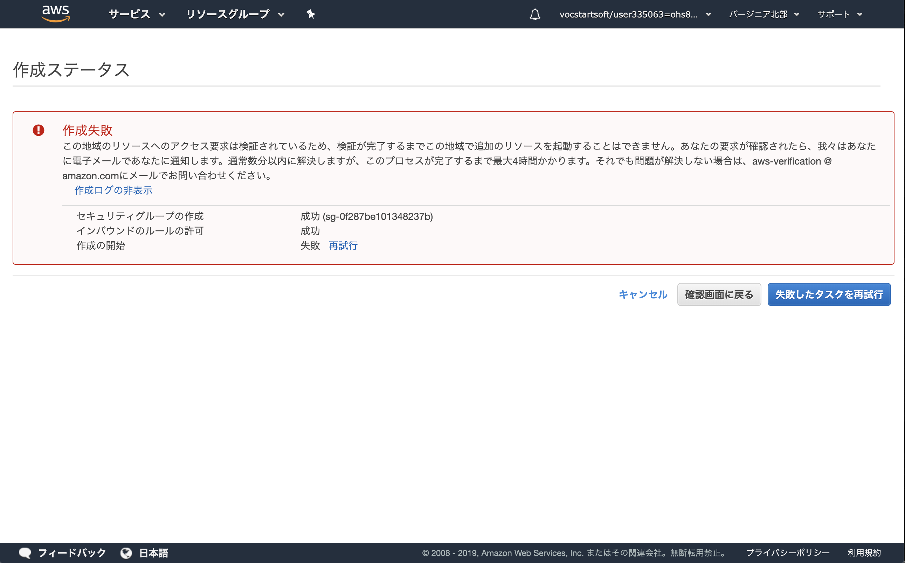
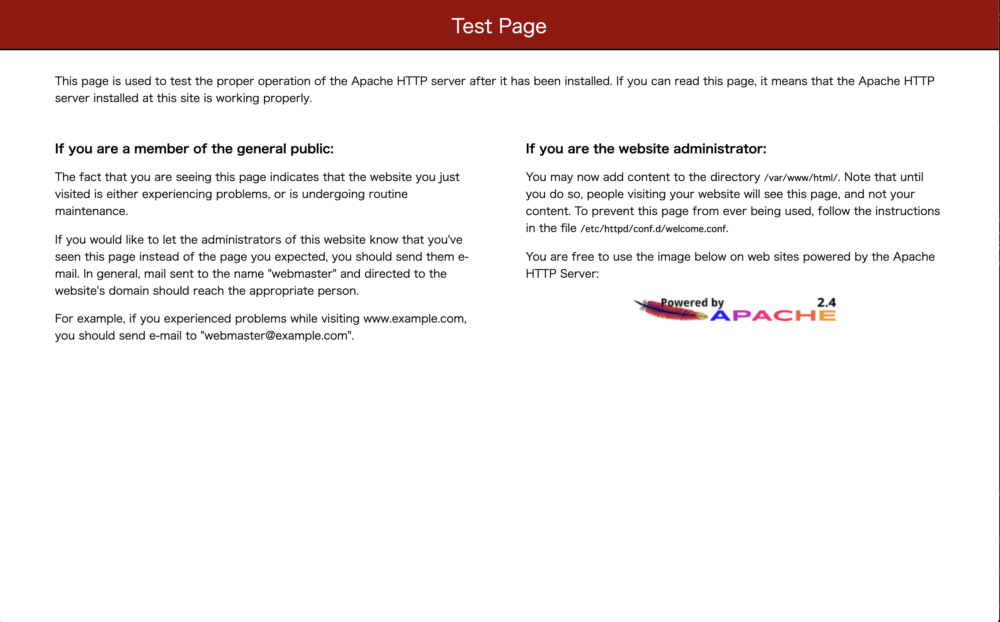
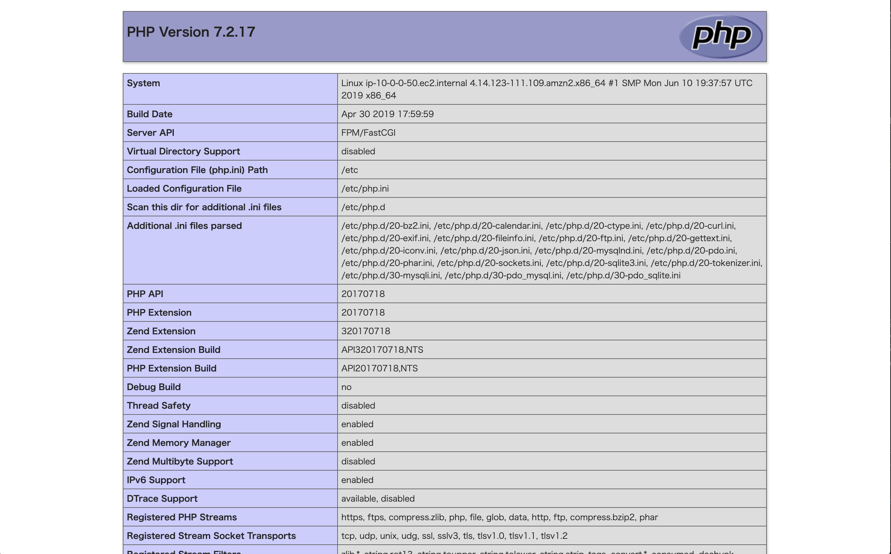

# Step-1
Step-1ではVPCを作成し、WordpressがインストールされたAMIを用いてEC2インスタンスを起動します。

## 概要図


----

## Question VPCとは
これから作成するAmazon VPC(Amazon Virtual Private Cloud)について調べてみましょう(10分)

[公式 Amazon Virtual Private Cloud](https://aws.amazon.com/jp/vpc/)

## Question アベイラビリティゾーンとは
アベイラビリティゾーンについて調べてみましょう(5分)

## VPCの作成
**実際にVPCを作成してみましょう。まずはサービスタブを選択しVPC管理ページを開きましょう**


----

**下にスクロールしVPCを選択します**


----

**VPCウィザードの開始を選択します**


----

**「ステップ1:VPC設定の選択」では「1個のパブリックサブネットを持つVPC」タブから選択ボタンを押下**


----

**「ステップ2:1個のパブリックサブネットを持つVPC」では以下を入力しVPCの作成ボタンを押下**

**VPC名: vpc-ユーザ名(例 vpc-user00 )**  
**アベイラビリティゾーン: us-east-1d**  


----

**「VPCが正常に作成されました」ではOKボタンを押下**


----

**「VPCダッシュボード」では直下の「VPCでフィルタリング」でユーザ名を入力しフィルタリングしましょう。以下の例ではuser00でフィルタリングしています**


----

**作成したVPCの設定が正しいかVPCタブをクリックし内容を確認しましょう**

**名前: vpc-ユーザ名**  
**IPv4 CIDR: 10.0.0.0/16**  


----

**ウィザードで作成したサブネットを確認しましょう。VPC作成ウィザードでは、VPC自体と一緒に1つ目のサブネットも作成されます。**


----

**作成したサブネットのRoute Tableを確認しましょう。VPCのネットワークアドレス 10.0.0.0/16 のターゲットがlocalに、デフォルトルートの 0.0.0.0/0 のターゲットがインタネットゲートウェイ(igw-XXXX)になっており、インターネットと通信できる設定になっています。**
 


----

## サブネットの追加作成

**作成したVPCに対して追加でサブネットを加えましょう。ここではサブネットの3つ作成を行いましょう**


----
**1から4を以下を参考に設定しましょう。**

|-|1 名前タグ|2 VPC|3 アベイラビリティ ゾーン|4 CIDR ブロック|
|:-|:-|:-|:-|:-|
|2つ目|パブリックサブネット|自分で作成したVPCを指定|us-east-1c|10.0.1.0/24|
|3つ目|プライベートサブネット|自分で作成したVPCを指定|us-east-1d|10.0.2.0/24|
|4つ目|プライベートサブネット|自分で作成したVPCを指定|us-east-1c|10.0.3.0/24|


----
**全てのサブネットを確認しましょう。4つ作成され赤枠の内容が設定通りか確認しましょう。その際にIPv4でソートすると見易いです。**


----
**パブリックサブネット(10.0.1.0/24)のルートテーブルを変更しましょう。パブリックサブネット(10.0.1.0/24)を選択しルートテーブルタブを選択、編集ボタンを押下**


----
**現在使用しているルートテーブル以外にもう一つ選択できるはずです。そちらを選択し保存ボタンにて保存しましょう。選択するとインターネットゲートウェイの設定が追加されます。**


----

## EC2インスタンスの作成
**ここでは10.0.0.0のパブリックサブネット内にEC2インスタンスを作成します。サービスタブからEC2を選択**


----
**Webサーバの作成を行いましょう。インスタンスの作成ボタンを押下**


----
**クイックスタートタブ、「Amazon Linux 2 AMI (HVM), SSD Volume Type」の選択ボタンを押下**



----
**t2.microを選択、次の手順：インスタンスの詳細の設定を押下**


----
**ネットワークには自分が作成したVPCを選択、サブネットは10.0.0.0/24(us-east-1d)のパブリックサブネットを選択、自動割り当てパブリックIPは有効化を選択し、次の手順：ストレージの選択を押下**


----
**ストレージの選択では特に何もせず、次の手順：タグの追加を押下**


----
**タグの追加を押下**


----
**キーに「Name」、値に「webserver#1-ユーザ名 例 webserver#1-user00 」を設定し次の手順：セキュリティグループの設定を押下**


----
**新しいセキュリティグループを作成するを選択、セキュリティグループ名は「web-ユーザ名 例 web-user00」を設定、説明も「web-ユーザ名 例 web-user00」を設定し、ルールの追加ボタンを押下**


----
**タイプはHTTPを選択、送信元は任意の場所を選択し確認と作成のボタンを押下**


----
**画面下にスクロールさせ作成を押下**


----
**EC2サーバにSSH接続する際に使用する秘密鍵を取得します。新しいキーペアの作成を選択、キーペア名は「ユーザ名 例 user00」を設定し、キーペアのダウンロードを押下、ダウンロードが成功したらインスタンスの作成ボタンを押下**


----

**私の環境ではエラー画面が表示されました。**

数分後に再試行すると作成できたのでしばらく待ちましょう。  



----

**EC2インスタンスが作成開始されました。インスタンスの表示ボタンを押下**


----
**作成したEC2インスタンスにて赤枠で囲った「パブリックDNS(IPv4)」の値をコピーしましょう。サーバログインのドメイン、アプリケーションのURLとなります。**


----

## Question AMIとは
今回AMIを使用してEC2インスタンスを作成しました。このAMIについて機能、役割などについて調べてみましょう(10分)

## サーバログイン
**作成したEC2インスタンスにログインし環境の確認をしましょう。`1day-userXX.pem`は各自が作成した秘密鍵、ec2-XXXXXX.comは「パブリックDNS(IPv4)」の値です。「ec2-user@ip-10-0-0-XX」のプロンプトが返れば成功です**

```
$ chmod 600 userXX.pem
$ ssh -i userXX.pem -o StrictHostKeyChecking=no ec2-user@ec2-XXXXXX.com
[ec2-user@ip-10-0-0-65 ~]$
```

## LAMPサーバの構築

**ApacheとMySQLのインストール**

```
$ sudo yum update -y
$ sudo amazon-linux-extras install -y lamp-mariadb10.2-php7.2 php7.2
$ sudo yum install -y httpd mariadb-server
$ sudo systemctl start httpd
$ sudo systemctl enable httpd
```

自分の`パブリック DNS (IPv4)`にアクセスしてみると、Apacheのテストページが表示される。  



**アクセス権の設定**

```
$ sudo usermod -a -G apache ec2-user
$ exit
```

sshで再接続

```
$ sudo chown -R ec2-user:apache /var/www
$ sudo chmod 2775 /var/www && find /var/www -type d -exec sudo chmod 2775 {} \;
$ find /var/www -type f -exec sudo chmod 0664 {} \;
```

**PHPの動作確認**

phpinfoファイル作成

```
$ echo "<?php phpinfo(); ?>" > /var/www/html/phpinfo.php
```

自分の`パブリック DNS (IPv4)/phpinfo.php`にアクセス。  



確認できたら消去しましょう。

```
$ rm /var/www/html/phpinfo.php
```

**MariaDB(MySQL)のインストール**

起動と初期設定  

```
$ sudo systemctl start mariadb
$ sudo systemctl enable mariadb
$ sudo mysql_secure_installation
```

諸々設定します。

```
Enter current password for root (enter for none):  # エンターキー押下
Set root password? [Y/n] # エンターキー押下
New password: # htc と入力
Remove anonymous users? [Y/n]  # エンターキー押下
Disallow root login remotely? [Y/n] # エンターキー押下
Remove test database and access to it? [Y/n] # エンターキー押下
Reload privilege tables now? [Y/n] # エンターキー押下
```

ログイン確認

```
$ mysql -uroot -p
Enter password: # htc と入力
```

ログインできたら成功。  

**使用するユーザーとデータベースの作成**

今回はhtcデータベースとhtcユーザーをパスワードhtcで作成する。  
**これはテスト用です！実運用の場合は危ないのでもっと考えてつけてください！**  

```
MariaDB [(none)]> CREATE DATABASE htc;
MariaDB [(none)]> CREATE USER 'htc'@'%' IDENTIFIED BY 'htc';
MariaDB [(none)]> GRANT ALL PRIVILEGES ON htc.* TO 'htc'@'%';

MariaDB [htc]> exit;
```

確かめてみる。

```
$ mysql -uhtc -p
Enter password: # htc と入力

MariaDB [(none)]> show databases;
+--------------------+
| Database           |
+--------------------+
| htc                |
| information_schema |
+--------------------+
MariaDB [(none)]> use htc;
Database changed
MariaDB [htc]> show tables;
Empty set (0.00 sec)

MariaDB [htc]> exit;
```

これでLAMPサーバが構築できました。

参考URL
https://docs.aws.amazon.com/ja_jp/AWSEC2/latest/UserGuide/ec2-lamp-amazon-linux-2.html

----

## サンプルアプリを動かしてみる

TODO! 
gitからアプリをcloneしてきてテーブルとサンプルデータSQLを流し込む。  
実際に動かしてみる！

----

## Question サーバチェック
1.このサーバに振られたIPアドレスの確認をしましょう。  
2.このサーバのデフォルトゲートウェイを確認しましょう。  
3.このサーバの基本スペック(CPU数、メモリ、DISK容量など)を確認しましょう。

----


**ここまでのオペレーションでStep1は完了です！**
