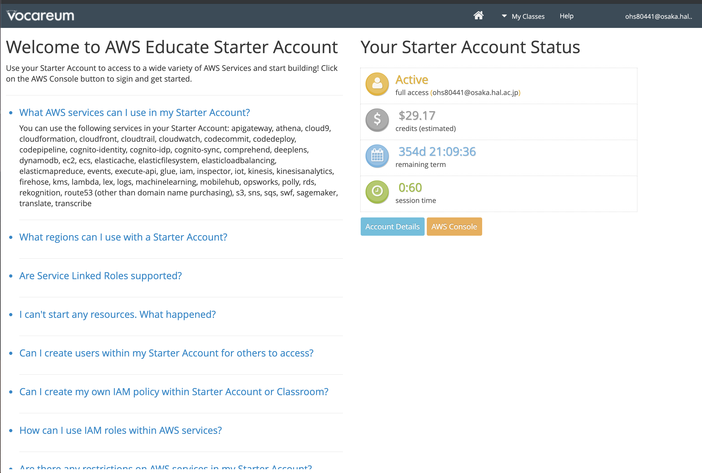
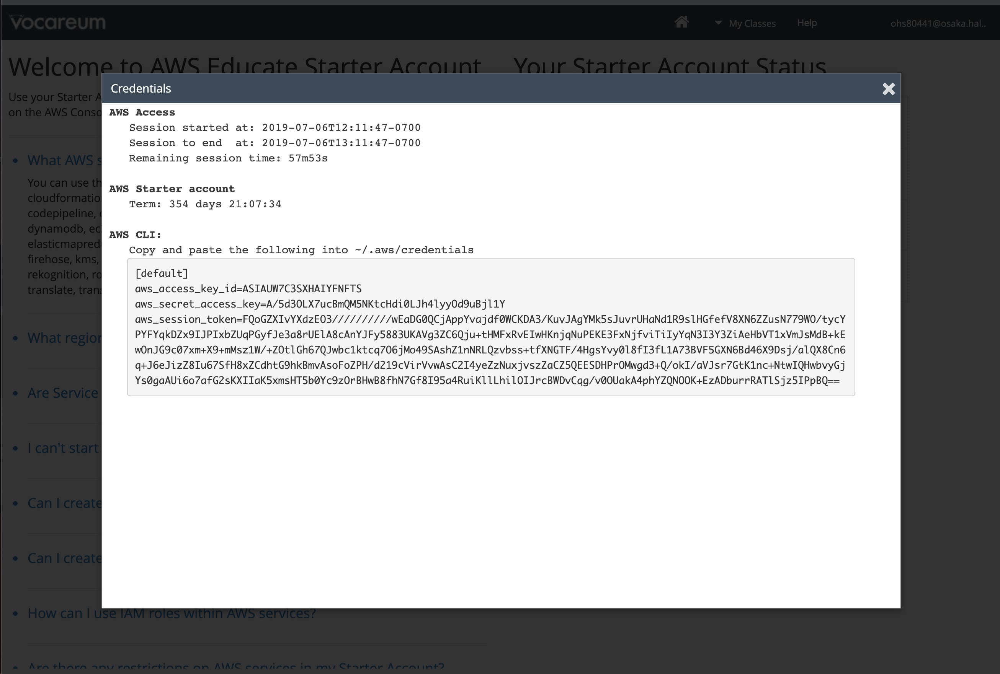

# Step-2
Step-2ではミドルウェアレベルでの垂直分散を行います。具体的には「パブリックサブネット」内のEC2単体で賄っていたミドルウェアのうちMySQLを「プライベートサブネット」に「Amazon Aurora MySQL」を利用して切り出します。更にStep-3でのWebサーバの水平分散を見越しアップロードファイルの格納場所をAmazon S3に変更し対応します。

## 概要図


----

## Question 垂直分散とは
垂直分散について調べてみましょう(10分)

## Question S3とは
S3について調べてみましょう(5分)

## DB用セキュリティグループの作成
**ここではStep-1で作成したEC2インスタンス内にあるMySQLを垂直分散させるために、10.0.2.0のプライベートサブネットに作るAurora用のセキュリティグループを作成します。サービスからEC2を選択しましょう**


----
**セキュリティグループタグからセキュリティグループの作成ボタンを押下**


----
**以下の設定値を設定しましょう。ルールの追加を押下**

|項目|設定値|
|:-|:-|
|セキュリティグループ名|db-ユーザ名 (例 db-user00)|
|説明|RDS for Aurora|
|VPC|作成したVPCを指定|


----
**MySQL/Auroraを選択し、ソースのカラムでは web などのキーワードで補完させ自分が作成したwebサーバ用のセキュリティグループを選択しましょう。選択ご作成ボタンを押下**


----
**作成したセキュリティグループ(db-userXX)が作成されていることを確認しましょう**


----

## DBサブネットグループの作成
**次にDB用のサブネットグループを作成します。サービスからRDSのリンクをクリック**


----
**左下のサブネットグループのリンクをクリックし、DBサブネットグループの作成ボタンを押下**


----
**サブネットグループの詳細を設定しましょう。名前は「db subnet userXX」XXは自身のユーザID、説明は「RDS for Aurora」、VPCは自身が作ったVPC(vpc-userXX)を指定しましょう**


----
**引き続き下にスクロールしサブネットの追加を行いましょう。以降のオペレーションをアベイラビリティゾーン1d,1cで行います。アベイラビリティゾーンから1dを選択、プライベートネットワークの10.0.2.0を選択、サブネットを追加しますボタンを押下、下段に追加されていることを確認、アベイラビリティゾーンから1cを選択、プライベートネットワークの10.0.3.0を選択、サブネットを追加しますボタンを押下、下段に追加されていることを確認、最後に作成ボタンを押下**


----
**作成されていることを確認しましょう**


----

## RDS Auroraインスタンスの作成
**これまでの準備を踏まえ、10.0.2.0のプライベートネットワークにRDS Auroraインスタンスを作成しましょう。データベースタブからデータベースの作成ボタンを押下**


----
**Amazon Auroraを選択し次へボタンを押下**


----
**マスターパスワードは「wordpress」を指定、DBインスタンスは一番上のdb.t2.smallを選択、その他は以下を確認しましょう。全て設定したら次へボタンを押下**

|項目|設定値|
|:-|:-|
|DBインスタンスのクラス|db.t2.small|
|マルチAZ配置|いいえ|
|DBインスタンス識別子|db-userXX XXは自身のID|
|マスターユーザの名前|admin|
|マスターパスワード|htchtchtc|


----
**ネットワークセキュリティでは以下の設定をしましょう**

|項目|設定値|
|:-|:-|
|Virtual Private Cloud (VPC)|自分が作成したVPCを選択|
|サブネットグループ|自分が作成したサブネットグループ「db subnet userXX」|
|パブリックアクセシビリティ|いいえを選択|
|アベイラビリティゾーン|ap-east-1d|
|VPCセキュリティグループ|既存のVPCセキュリティグループの選択|
|VPCセキュリティグループを選択|作成したDB用のセキュリティグループを指定、合わせてdefaultは削除|


----
**データベースの設定は以下の設定をしましょう**

|項目|設定値|
|:-|:-|
|DBクラスター識別子|設定しない|
|データベースの名前|htc|
|データベースのポート|3306|
|DBパラメータグループ|そのまま|
|DBクラスターのパラメータグループ|そのまま|


----
**暗号化は無効にしましょう**


----
**下にスクロールし、拡張モニタリングを無効に設定、メンテナンス：マイナーバージョン自動アップグレードの無効化に設定**


----
**一番下までスクロールし、削除保護のチェックを外しましょう。最後にDBインスタンスの作成ボタンを押下**


----
**DBインスタンスの詳細の表示ボタンを押下**


----
**左のデータベースタブをクリックし、右側に作成したAuroraクラスター、インスタンスが表示されることを確認しましょう。ステータスが利用可能になるまでに数分掛かります**


----

## Question RDS、Auroraとは
今作成したRDS(Relational Database Service)、Auroraについて調べてみましょう(10分)

----
**クラスターのリンクをクリックし自分のユーザ名のあるクラスター識別子のリンクをクリックしましょう**


----
**クラスターエンドポイント(上)、読み込みエンドポイント(下)をメモしましょう。このエンドポイントがAuroraにアクセスする際に利用します**


----

## 接続確認
**EC2サーバにSSH接続し、EC2サーバからAuroraに接続してみましょう。また作成したAuroraインスタンスが意図したセグメントに配置されているかも確認しましょう。**

```
$ ssh -i 1day-userXX.pem -o StrictHostKeyChecking=no ec2-user@ec2-XXXXXX.com
[ec2-user@ip-10-0-0-65 ~]$
```

**クラスタエンドポイントを使用してAuroraに接続しましょう。読み書きの権限についても確認しましょう。**

**注意 wp-userXX-cluster.cluster-cenae7eyijpr.us-east-1.rds.amazonaws.comは各自のクラスタエンドポイントに直すこと。パスワードはAurora作成時に設定した内容を指定すること**

```
$ mysql -u admin -p -hdb-user00-cluster.cluster-cenae7eyijpr.ap-northeast-1.rds.amazonaws.com

mysql> show databases;
+--------------------+
| Database           |
+--------------------+
| information_schema |
| mysql              |
| performance_schema |
| htc                |
+--------------------+
4 rows in set (0.00 sec)

mysql> exit
```

**続いてネットワークセグメントの確認(クラスタエンドポイント)をしましょう**

```
$ nslookup db-user00-cluster.cluster-cenae7eyijpr.ap-northeast-1.rds.amazonaws.com
Server:     10.0.0.2
Address:    10.0.0.2#53

Non-authoritative answer:
db-user00-cluster.cluster-cenae7eyijpr.ap-northeast-1.rds.amazonaws.com canonical name = db-user00.cenae7eyijpr.ap-northeast-1.rds.amazonaws.com.
Name:   db-user00.cenae7eyijpr.ap-northeast-1.rds.amazonaws.com
Address: 10.0.2.226
```

**読み込みエンドポイントを使用してAuroraに接続しましょう。読み書きの権限についても確認しましょう。**

**注意 wp-userXX-cluster.cluster-ro-cenae7eyijpr.us-east-1.rds.amazonaws.comは各自の読み込みエンドポイントに直すこと。パスワードはAurora作成時に設定した内容を指定すること**

```
$ mysql -u admin -p -hwp-userXX-cluster.cluster-ro-cenae7eyijpr.ap-northeast-1.rds.amazonaws.com

mysql> show databases;
+--------------------+
| Database           |
+--------------------+
| information_schema |
| mysql              |
| performance_schema |
| htc                |
+--------------------+
4 rows in set (0.00 sec)

mysql> exit
```

**続いてネットワークセグメントの確認(読み込みエンドポイント)をしましょう**

```

$ nslookup wp-user05-cluster.cluster-ro-cenae7eyijpr.ap-northeast-1.rds.amazonaws.com
Server:     10.0.0.2
Address:    10.0.0.2#53

Non-authoritative answer:
wp-user05-cluster.cluster-ro-cenae7eyijpr.ap-northeast-1.rds.amazonaws.com  canonical name = wp-user05.cenae7eyijpr.ap-northeast-1.rds.amazonaws.com.
Name:   wp-user05.cenae7eyijpr.ap-northeast-1.rds.amazonaws.com
Address: 10.0.2.226
```

## データ移行
**原始的なバックアップリストアの機能を用いてEC2インスタンスのMySQL内にあるWordpressのデータをAuroraに移行します**

**EC2インスタンスにログイン(事前にログインしてる場合は割愛する)**

```
$ ssh -i 1day-userXX.pem -o StrictHostKeyChecking=no ec2-user@ec2-XXXXXX.com
[ec2-user@ip-10-0-0-65 ~]$
```

**mysqldumpを使いEC2インスタンスMySQLからデータバックアップ。パスワードは設定した内容を指定(wordpress)**

```
$ mysqldump -u root -p htc > export.sql
Enter password:
[ec2-user@ip-10-0-0-65 ~]$ ll
合計 220
-rw-rw-r-- 1 ec2-user ec2-user 221255  3月 30 00:55 export.sql
```

**EC2インスタンスのMySQLは今後使用しないので停止し、自動起動の設定を抑止しましょう**

```
$ sudo systemctl disable mariadb.service
$ sudo systemctl stop mariadb.service
```

**データベースのリストア**

**Auroraのクラスタエンドポイントを指定してexport.sqlをリストアしましょう**

```
mysql -u admin -p -hdb-userXX-cluster.cluster-cenae7eyijpr.ap-northeast-1.rds.amazonaws.com  wordpress < export.sql
Enter password:
```

## DB接続変更

```
$ sudo nano /var/www/html/api/config.php
+ define('HOST','db-user00-cluster.cluster-cxqc1uzxewle.us-east-1.rds.amazonaws.com');
// MySQLのユーザー名
+ define('USER', 'admin');
// MySQLのパスワード
+ define('PASSWORD', 'htchtchtc');
```

**EC2インスタンスのパブリック DNS (IPv4)を開きましょう。データリストア前と同様に表示されれば成功です。**

**EC2インスタンスにログイン(事前にログインしてる場合は割愛する)**

```
$ ssh -i 1day-userXX.pem -o StrictHostKeyChecking=no ec2-user@ec2-XXXXXX.com
[ec2-user@ip-10-0-0-65 ~]$
```
**ここからアクセスキー、シークレットアクセスキー、トークンを取得します**
キーの期限が一時間しか無いため試しに使ってみた後、こちらで用意したS3に切り替えます。

右真ん中にあるAccount Detailボタンをクリック。

AWS CLIの横にあるShowをクリック。

表示されているのが接続に必要となるキーです。

**以下の2行(+は不要)を追記しましょう。アクセスキー、シークレットアクセスキーは上で準備したものに書き換えましょう**
```diff
$ sudo nano /var/www/html/api/config.php
+ define( 'AWS_ACCESS_KEY_ID', '********************' );
+ define( 'AWS_SECRET_ACCESS_KEY', '********************************' );
+ define('AWS_SESSION_TOKEN', '********************************');
+ define('S3_BUCKET_NAME', 'htc-hands-on-01');
```
動作確認しましょう。  
画像を投稿してみてS3に上がっていたら成功です。

動作確認後、用意したS3キーをSlackに流しますので上記と同様に書き換えてください。  
（こちらで用意したものにはAWS_SESSION_TOKENは不要）

----
**S3の作成、サービスからS3を選択**


----
**バケットを作成するボタンを押下**


----
**S3名は「s3-1day-userXX」ユーザIDは自身のを指定、その後、作成ボタンを押下**


----
**作成したS3のリンクを押下**


----
**アクセス権限、パブリックアクセス権限、編集を押下**


----
**チェックを全て外す**


**注意：このACLの設定は今回の勉強会用であり、正規のサイト構築時にはNGです。必要なACLの設定を心がけましょう**
----
**アクセスコントロールリスト、Everyoneを押下**


----
**全てにチェックを入れ保存を押下**


----
**ここまでのオペレーションでStep2は完了です！**
