# AWS Educate Starter

## 概要

学生ならAWSのクレジットをちょっとだけもらえたり、学習用コンテンツを利用できたりするサービスです。  
クレジットカードなしで利用できるため、今回はこの無料クレジットを利用してハンズオンを進めていくので事前に登録しておいてください。  
ちなみにGitHub Student Developer Pack経由で登録するとクレジットが多めにもらえるので少しでも長く使いたい人はそちら経由で申し込むことをおすすめします。  

クレジットカードを持っている方は正式なAWSアカウントも使用可能なのでそちらで作成したり、既存のAWSアカウントを使っても構いません。

参考  
https://qiita.com/guitar_char/items/609045ae9e7e50505772  
https://qiita.com/DaiHasegawa/items/9f8865d00a1b4372d41e  

## 登録手順

ここから「AWS Educateに参加する」をクリックして登録  
[https://aws.amazon.com/jp/education/awseducate/](https://aws.amazon.com/jp/education/awseducate/)  

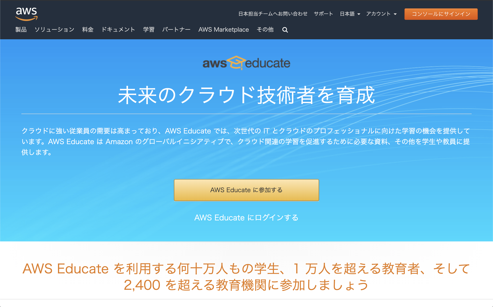

### step1

学生を選択  
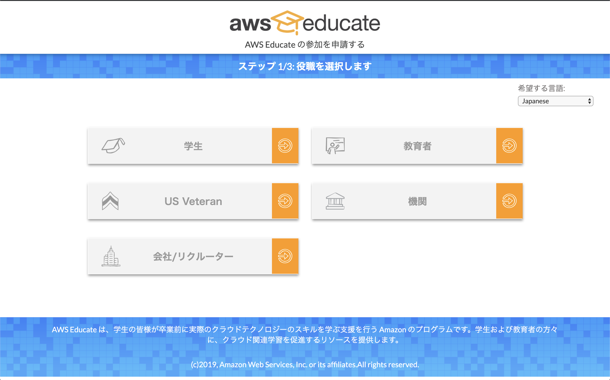  

### step2

必要情報を入力  
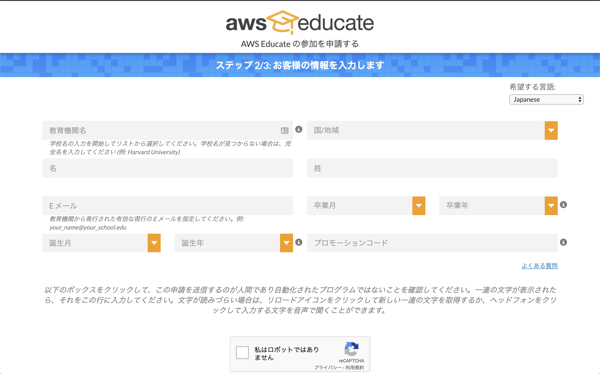  

* 教育機関名:HAL Osaka
* 国/地域:日本
* 名・姓:自分の名前（ローマ字）
* Eメール:`ohs99999`@osaka.hal.ac.jp  
`ohs99999`の部分は自分の学籍番号に読み替えてください。  
* 卒業月/年:自分の卒業月/年を選択  
* 誕生月/年:自分の誕生月/年を選択  

次に進んで登録を完了させてください。  

### step3

メールアドレスの確認メールが届くのでURLを踏む。  
申請完了メールを受信したら一旦完了。  
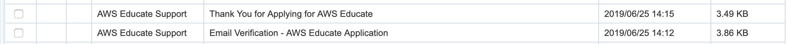  

### step4

約１日後、`AWS Educate Application Approved`というメールが届いたら登録完了。メール本文に従ってパスワードを設定、ログインできるようにする。  
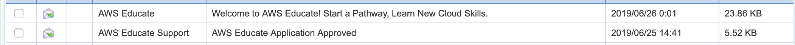  

### step5

登録したEmailとパスワードでログインする。  
[https://www.awseducate.com/signin/SiteLogin](https://www.awseducate.com/signin/SiteLogin)  
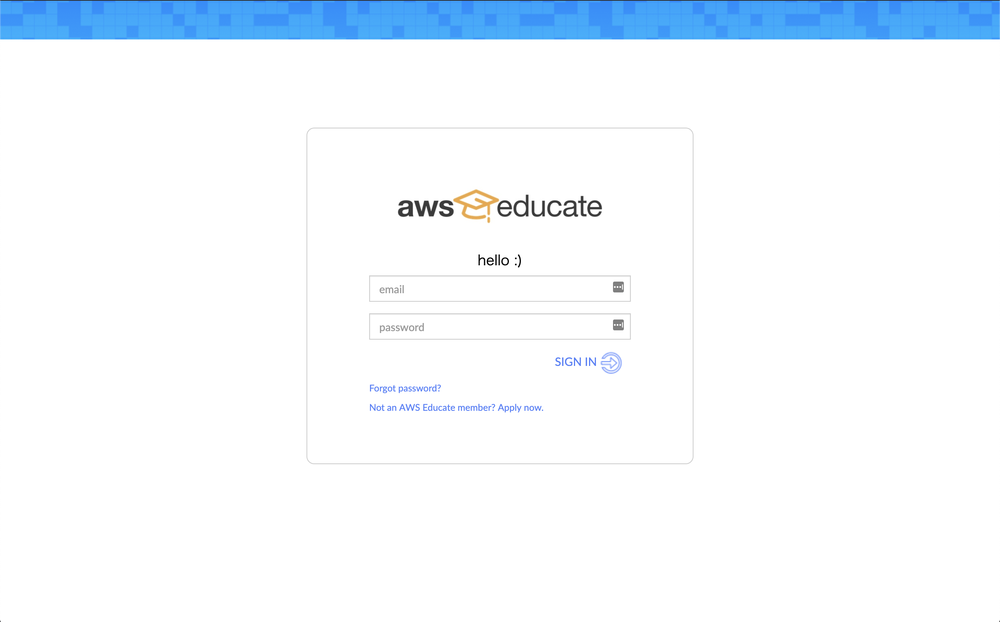  

### step6

ログインしたらこのような画面が表示されふはずです。  
画面右側の`Use an AWS Educate Starter Account →`をクリックします。
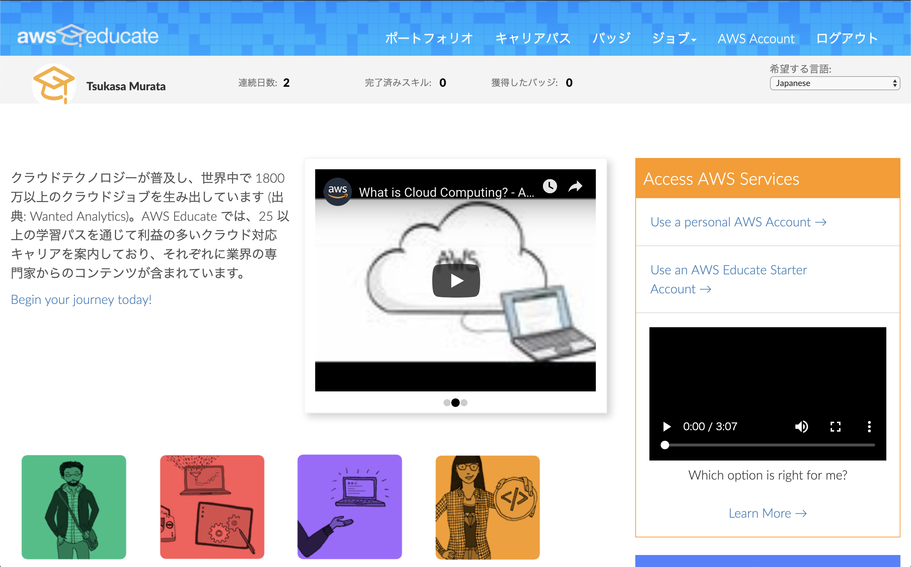  

### step7

Create Starter Accountをクリック。
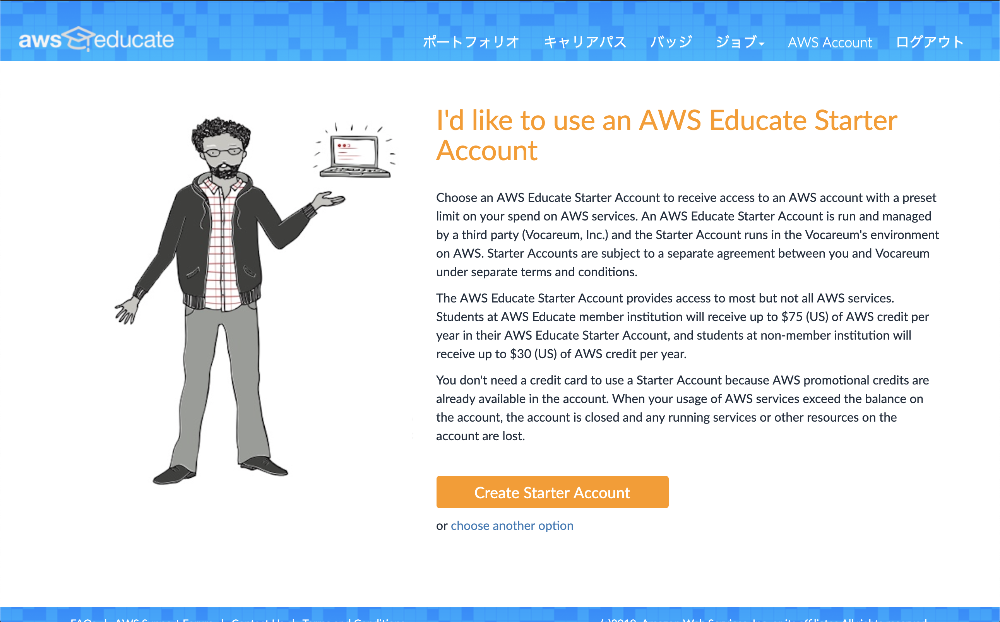  

### step8

Create Starter Accountをクリック。  
（今回は2020/6/25まで使える30クレジットもらえるらしい）  
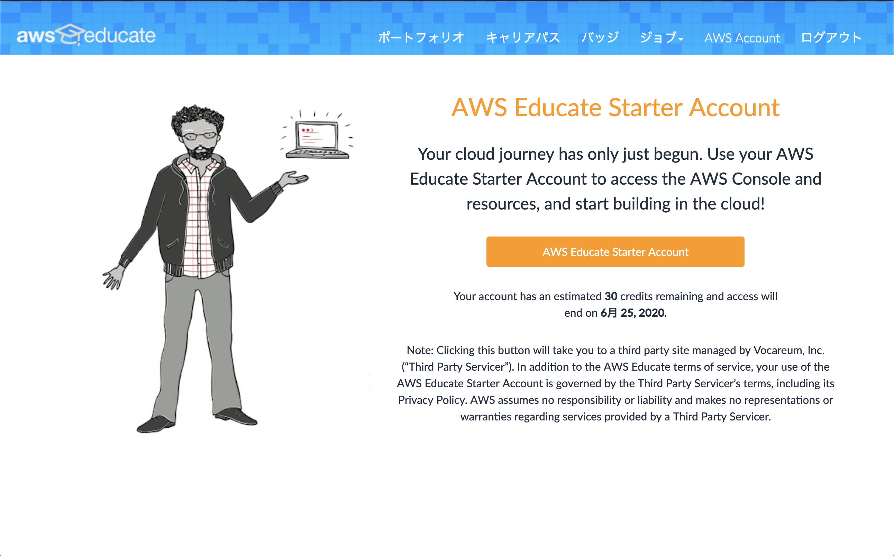  

利用規約が出てくるので同意する。  

### step9

これでアカウント作成は完了です。  
AWS Consoleをクリックするとマネジメントコンソールが出てくるので見てみましょう。
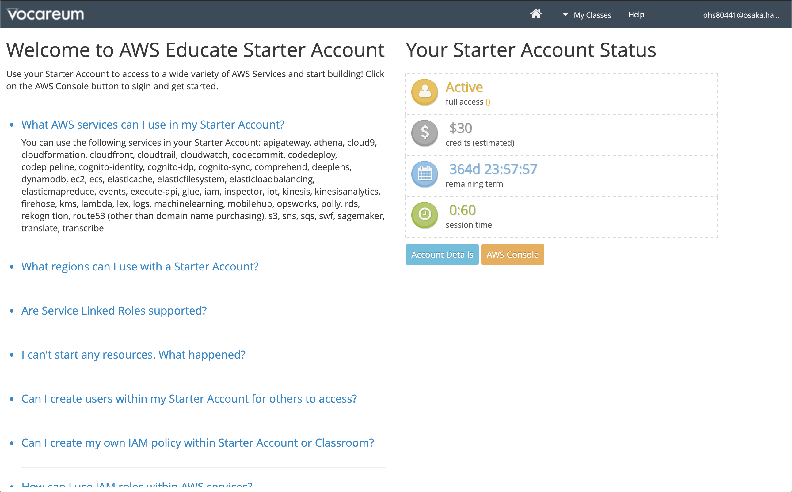  
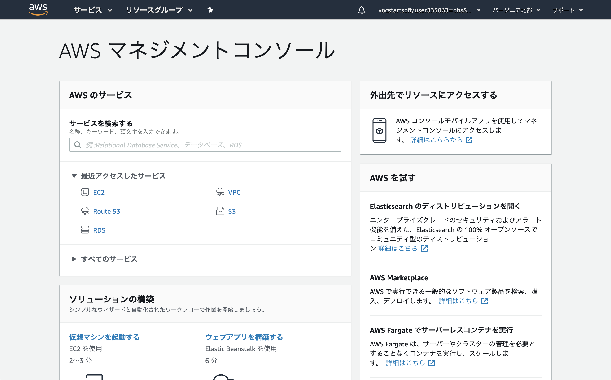  
